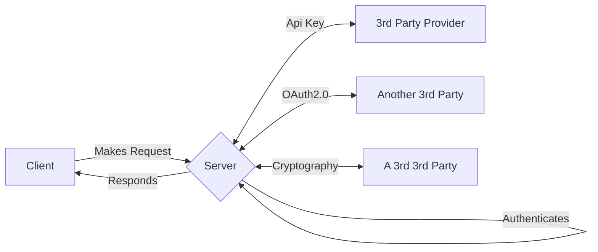
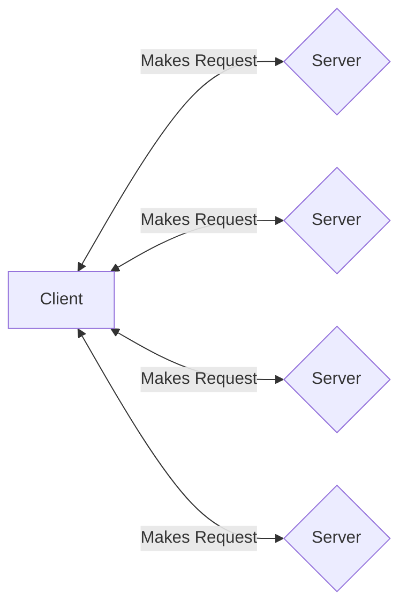
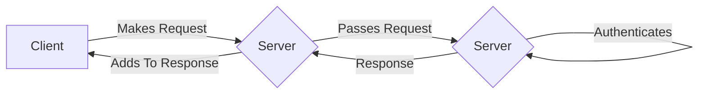
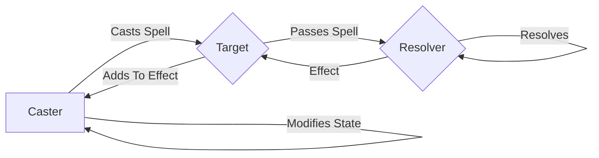
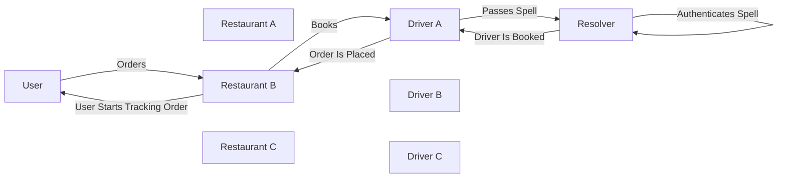
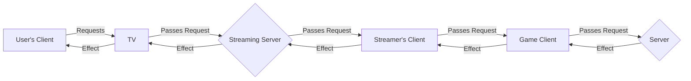
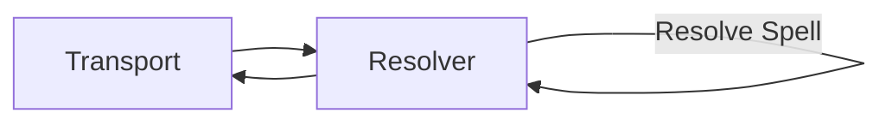

# MAGIC

*MAGIC* is a protocol that genericizes the multi-platform payment settlement flow to allow for both money and moneyless transactions between multiple untrusted clients, servers, and peers.

## Overview

This repository contains implementations of the MAGIC protocol in various languages, on various platforms, and, since multiple devices are involved in MAGICal transactions, via various transports.
This is a protocol enabled by the asymmetric cryptography of the [Sessionless protocol][sessionless].
If you're unfamiliar with Sessionless, I encourage you to check out its repo, or one of its implementations before diving into MAGIC.

In a standard client/server relationship, clients make requests to a server, which authenticates the client to make the request, and then serves a response.
This relationship is 1:1 because the traditional method of authorization is via a shared secret between client and server.
Sometimes communication to a third party is facilitated via server to server communication authorized by API key (another type of shared secret), or via OAuth2.0, which is a flow that generates, you guessed it, a shared secret. 

Let's imagine a system with multiple such integrations:



As you can see the server acts as the hub for all of these integrations, and for many of us who develop for a living, adding the line from third party provider to client is what we spend a lot of our time doing.

With Sessionless, however, no shared secret is necessary anywhere along the pipeline. 
This makes a couple of interesting interactions possible. 
First, Sessionless-enabled clients don't need to rely on a single server for authenticated requests. 
Let me show you that picture:



If you think about a federated network like the Fediverse, this type of picture would let you build a client that can display Mastodon, Pixelfed, Lemmy, etc, all in one *without* having to set up your own server that combines all of them. 
Just find Sessionless enabled servers for them (or add Sessionless to existing ones), and that client is possible.

I think this is a great use case for Sessionless, but it's not what we're going to call MAGIC.
Instead, I'd like you to consider this picture:



Here the client passes an authenticated request to a server, which in turn passes that request to a second server for authentication.
If the signed message sent from the client is what is signed, then the middle server can't modify the request, and have it be authenticated by the server on the right.
At the same time, if the middle server is known to the server on the right it can add its own signed message to the request for authentication. 
The server on the right, authenticates one or both messages, and sends back a response, which allows the middle server and the client to respond to the success.

Since the server on the right is known to both the client and middle server, the client and middle server need not establish a trust relationship before this interaction.
And *that* is what we call MAGIC.

Some terminology.
In a moneyed interaction, this flow could be called a transactional pipeline, but since MAGIC enables this flow when nothing is actually exchanged, a broader term is needed.
And since I want to stay on brand, let's call it a spell.


* The initiator of a spell is the caster.
* The first receiver of a spell is the spell's target.
* The server that authenticates all the messages is the spell's resolver.
* The intermidaries (of which there can be an arbitrary amount) of a spell are called gateways.
* Targets are gateways.
* Resolvers are gateways. 
* The response to a spell is its effect.
* Effects may affect any number of the gateways involved.
* Effects always modify something in either the caster, the target, or both.

So the MAGICal interaction above gets renamed as such:



## Use Cases

Consider a simplified food delivery app like DoorDash. 
We want users (casters), to be able to order (cast) from restaurants (targets), get their food delivered from some unaffiliated group of drivers (gateways), and have money disbursed from the user (caster) to the restaurant and driver (gateways) from some server that knows about all of them (resolver).

Let's look at that picture:



Now in current food delivery apps, the user, restaurant, driver, and resolver are all part of the same platform.
That's great for the platform, and not so great for everyone else involved.

Now I'm not going to say anything hyperbolic like we can replace every platform with decentralized pieces that can be Voltroned (It's an unfortunate reality of being alive that not everyone will get your cultural references.
Voltron was an animated American show in the eighties that featured a group of teenagers fighting aliens in animal-shaped robot spaceships.
[They could combine these spaceships into one giant spaceship robot called Voltron][voltron].
To five year old me it was about as awesome a thing as could occur) together to replace every centralized platform out there.

But with MAGIC we could do that.

Here are some other use cases:

* Ridesharing
* Order placement (why on Earth do we have to enter our address _every_ single time we order from a new site?)
* Multi-client pipelines like phone -> TV app, or phone -> gaming console
* POS systems
* Novel monetization, and signup systems for saas platforms

But moneyed pipelines are only one side of the use case story.
What I think is arguably even more interesting is what MAGIC can do for systems that want interaction, but don't need money to change hands. 
First, what kind of interaction is that?

Let's get a little pie in the sky. 
Imagine you're watching a streamer playing a game on some unnamed streaming platform on your TV, and they get to a tough boss fight, and you want to send them an extra health potion to use during the fight. 
Let's take a look at what would need to happen for that to happen:



Now throwing your favorite streamer a health potion in a game is a pretty cool interaction, and it's one that to the best of my knowledge doesn't exist right now.
Why?
Well fundamentally letting user A (the user watching the stream) do something in user B (the streamer)'s client is just not done.
For one it requires several heavy handed integrations to do with traditional auth systems, which might be ok for moneyed transactions, but just doesn't make sense for unmoneyed transactions.
For two, traditional auth can't pass authenticated requests through multiple clients and servers, but asymmetric cryptography like that used in Sessionless can.

Notice that the streaming clients and server don't need to *do* anything other than pass the request and the effect along between the caster and resolver. 
This means to implement this, the game doesn't need to worry about what streaming platforms it needs to know about, and the casting client doesn't need to know about what games it works with.
Figuring out how to communicate that to the user is a [UX question][ux], but the fact that you can create experiences like this without integrations all over the place is pretty magical to me.

Here are some other unmoneyed use cases:

* Opt-in interactions (sharing email, address, getting promos/deals)
* Interactions proxied through extensible clients (chat clients with bots like Slack and Discord, content aggregators with APIs like Reddit and Twitter)
* Accountless interactions on content sites like blogs
* Interactions with media through clients not owned by that media

## Getting started

> **Note**: This repo is a work in progress.

This repo is organized by language.
Each language is divided into transport implementations like https, websocket, and ble. 
For languages with clients, there are both client and server implementations.
If you want to implement this system in your app, you'll likely want to start at your language's package manager ([npm], [CocoaPods], [Maven], etc). Links for those can be found at the end of this doc.

It wouldn't be MAGIC without spells.
While MAGIC defines the overarching protocol for constructing multi-device authenticated requests, spells define the specific properties required from each participant in a pipeline to resolve that spell.
Let's take a look at our food delivery clone again.

The MAGIC protocol requires from the caster:

```json
{
  timestamp: string,
  spell: string,
  casterUUID: string,
  totalCost: non-zero int, 
  mp: bool,
  ordinal: int,
  casterSignature: signature,
  gateways: []
}
```

Where `timestamp` is the time of the transaction as a string in milliseconds from epoch.
`spell` is the name of the spell, which may require additional information for resolution.
`casterUUID` is the uuid of the caster.
`totalCost` is the non-zero cost of the transaction (zero cost transactions allow for MAGICal abuse).
`mp` is truthy for non-moneyed transactions, and false for moneyed transactions (currencies for things are resolved by resolvers).
`ordinal` is a number that increments with every spell that resolves.
This makes spells idempotent, and diminishes vulnerability to replay attacks.
`casterSignature` is the signature of this original message from the caster.
`gateways` starts as an empty array, and is where the target, and various gateways will add themselves to the pipeline.

Next comes the restaurant who adds their details to the payload:

```json
{ 
  timestamp: string,
  spell: string,
  casterUUID: string, 
  totalCost: non-zero int,
  mp: bool,
  ordinal: int,
  casterSignature: signature,
  gateways: [{
    timestamp: string,
    uuid: string,
    minimumCost: non-zero int,
    ordinal: int,
    signature: signature
  }]
}
```

`minimumCost` is the minimum amount that needs to resolve to the restaurant to complete the delivery.
Because gateways may not have pre-negotiated fees, the resolver needs to know their requirements for fulfilling a spell.
In this instance, if the amount a delivery driver is looking for exceeds the amount the restaurant is willing to pay, then the spell doesn't resolve and the order isn't fulfulled.

Next we'll add the driver:

```json
{
  timestamp: string,
  spell: string,
  casterUUID: string,
  totalCost: non-zero int,
  mp: bool,
  ordinal: int,
  casterSignature: signature,
  gateways: [{
    timestamp: string,
    uuid: string,
    minimumCost: non-zero int,
    ordinal: int,
    signature: signature
  },{
    timestamp: string,
    uuid: string,
    minimumCost: non-zero int,
    ordinal: int,
    signature: signature
  }]
}
```

And that gets passed to the resolver who, in this case, makes sure the minimumCosts are less than totalCost (further price negotiation is left to implementers), makes sure that the uuids of the gateways fulfill the roles of the spell (that one's a restaurant, and one's a driver), checks the signatures against their respective messages, and then sends back yay or nay based on all of that.
When the driver receives yay they start the delivery process.
When the restaurant receives yay, they start preparing the food.
When the caster receives yay, their client can start the tracking UX.

The above is the minimum for a MAGICal spell, but spells can add whatever optional fields they want for their resolution.
Let's say for example you wanted to make sure the driver was within five miles of the restaurant when the spell resolves (you'd want to take care of this before it got to the resolver in a real system, but using this for an example because it's easy to imagine sending geo data). 
Your reolvable payload could then become:

```json
{
  timestamp: string,
  spell: string,
  casterUUID: string,
  totalCost: non-zero int,
  mp: bool,
  ordinal: int,
  casterSignature: signature,
  gateways: [{
    timestamp: string,
    uuid: string, 
    minimumCost: non-zero int,
    ordinal: int, 
    signature: signature
  },{ 
    timestamp: string,
    uuid: string,
    minimumCost: non-zero int,
    ordinal: int,
    **currentLocation**: geolocation,
    signature: signature
  }]
}
```

`currentLocation` could then be checked against the restaurant's location if it's stored. 
If it's not stored, the spell can just require the restaurant to send its location as well.

My hope is that, like spells in fantasy works, these spells become something written down and shared for practitioners of MAGIC to learn and use.

## mp?

The astute observer of the MAGICal JSON above will have noticed this abbreviation, which has very intentionally been used to invoke the sense of magic power as used in games.

With spells that don't cost money, you have to worry about computers spawning millions of requests.
*Especially* if the interaction gives anything of value.
This isn't much of a problem with standard systems, because requests are gated by the system's authentication, but in a MAGIC spell, those requests might pass through any number of gateways.
Since the effect on the gateway of that is unknown, responsible casters shouldn't spam the gateways, but since it's the internet and you can't just boot irresponsible casters, you've got to do something else instead.

So we use Magic Power (MP).

If you've played a game with mp that recharges in real time like Skyrim, this will seem familiar.
The resolver grants to every user a renewable supply of MP that caps at a certain amount per user.
Non-money spells expend this mp as their cost so that users can't spam spells that don't cost actual money.

For example, a streamer might install an extension that makes a unicorn appear on screen when someone interacts with them. 
So as to avoid constant unicorn spam (the name of my next band), the streamer attaches a cost of 400 mp to the spell.
The resolver of the spell caps users' mp at 1,000 mp so at most any one user can unicorn twice before needing to recharge their mp.

I encourage anyone implementing a resolver to get as creative with this as they want.
For instance, since mp is expended and not transferred, you might want to generate something for the caster and target of a spell.
As a bit of foreshadowing, this is what I did when I first built all of this out.
I generated tokens for everyone called Nineum.
What is Nineum you ask, we'll find out further up the stack.

## More on casters, gateways, and resolvers

### Casters

The G in MAGIC is for Generic, and the I stands for Input/output.
In general, MAGIC doesn't care about input and output, but your spells should if they are transacting money.
For anything that spends money it's important that your caster's input be an action performed by a human if the money is coming from a human's bank account (you could imagine totally automated spells like for subscriptions, but in general humans should be approving when their money is moved around). 

### Gateways

Pretty much any computing machine that can connect to another computing machine can be used as a gateway.
In fact this means that you can send messages through offline transports like BLE, NFC, RFID, QR Code, OCR, etc.
I haven't really thought through the ramifications of a fully offline MAGICal system, but it should be possible.

### Resolvers

Resolvers have two responsibilities.
They are the custodians of MAGICal identities, and they either move money around, expend magic power, or both.
If they move money around they will have to be responsible for the legal ramifications of that.
If they expend magic power they'll have to adhere to some TBD rules to make it so that users don't end up with fifty different mps to keep track of.

## Contributing

To add to this repo, feel free to make a [pull request][pr].

### Caster protocol

Since fulfilling the caster protocol is platform dependent, there might be several for each language.
Caster implementations need to look like this:


Where input could be tapping a button on mobile, typing a command in a chatbot, controller input in a game, accelerometer data in a hardware device, etc.
CasterJSON is this:

```json
{
  timestamp: string,
  spell: string,
  casterUUID: string,
  totalCost: non-zero int,
  mp: bool,
  ordinal: int,
  casterSignature: signature,
  gateways: []
}
```

And transport is something like https, websocket, udp, etc.

### Gateway protocol

Gateways have a pretty straightforward flow:


Where transports are still transports, and GatewayJSON looks like:

```json
{
  timestamp: string,
  spell: string,
  uuid: string,
  minimumCost: non-zero int,
  ordinal: int,
  signature: signature
}
```

And is added to the gateways array in the spell payload.

### Resolvers protocol



Resolvers have the same transport needs as gateways, and have an additional function:

`resolveSpell(spell) -> {success: bool}`

Where spell is the spellPayload:

```json
{
  timestamp: string,
  spell: string,
  casterUUID: string,
  totalCost: non-zero int,
  mp: bool,
  ordinal: int,
  casterSignature: signature,
  gateways: [{
    timestamp: string,
    uuid: string,
    minimumCost: non-zero int,
    ordinal: int,
    signature: signature
  },{
    timestamp: string,
    uuid: string,
    minimumCost: non-zero int,
    ordinal: int,
    **currentLocation**: geolocation,
    signature: signature
  }]
}
```

It is left to implementers to write how spells are checked for resolution. 

### Spell protocol

In my heart of hearts I would like there to be different "flavors" of MAGIC, and to that end I'm hesitant to put too much structure around what constitutes a spell.
At the very least there needs to be *something* that tells each gateway how to get to the next gateway.
For transports like https there's a well-established protocol for that, but for transports like BLE it's a bit more nebulous.

Similarly should spells allow arbitrary input from casters, or specific casters.
If it's the latter, how do we limit that being spoofed from different devices?
Should we?

All this is to say that the spell protocol, should one arise, has yet to be established.
Questions, comments, and concerns welcome.

## Examples

Due to MAGIC's interoperability, the permutations of possible MAGICal pipelines in this repo is combinatorial, and creating a test for all of them is beyond our present scope.
Still, examples will be provided as casters, gateways, and resolvers are built and some way of putting them together will be found.
Contributors are highly encouraged to put together any example they want for any use case no matter how impossible it may seem.

## Further reading

(Coming Soon)

[sessionless]: https://www.github.com/planet-nine-app/sessionless
[voltron]: https://www.youtube.com/watch?v=2M3cyCFWChg
[ux]: https://www.github.com/planet-nine-app/MAGIC/README-UX.md
[cocoapods]: https://cocoapods.org
[maven]: https://maven.apache.org
[npm]: https://npmjs.org
[pr]: https://github.com/planet-nine-app/sessionless/pulls

