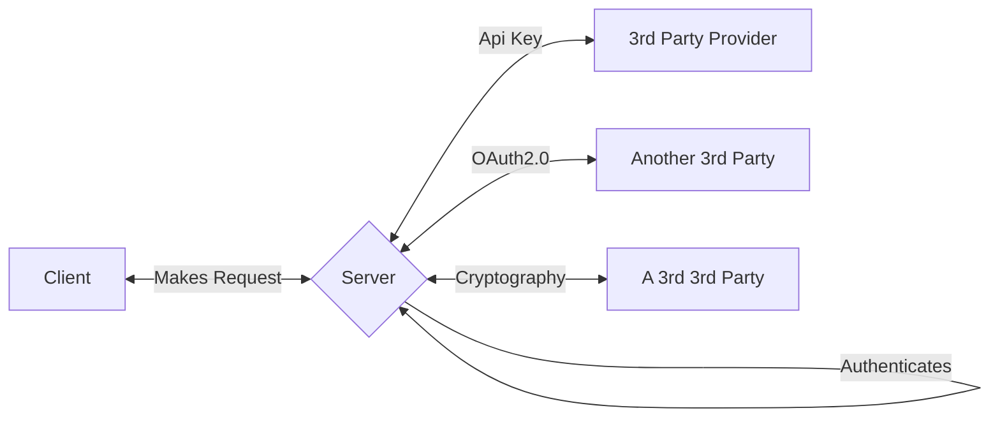
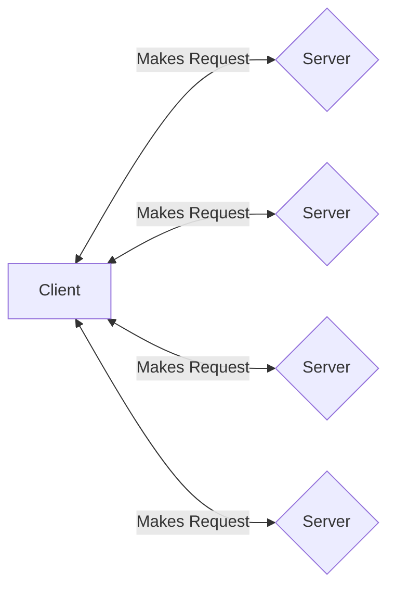

# MAGIC

*MAGIC* is a protocol that genericizes the multi-platform payment settlement flow to allow for both money and moneyless transactions between multiple untrusted clients, servers, and peers.

## Overview

This repository contains implementations of the MAGIC protocol in various languages, on various platforms, and, since multiple devices are involved in MAGICal transactions, via various transports.
This is a protocol enabled by the asymmetric cryptography of the [Sessionless protocol][sessionless].
If you're unfamiliar with Sessionless, I encourage you to check out its repo, or one of its implementations before diving into MAGIC.

In a standard client/server relationship, clients make requests to a server, which authenticates the client to make the request, and then serves a response.
This relationship is 1:1 because the traditional method of authorization is via a shared secret between client and server.
Sometimes communication to a third party is facilitated via server to server communication authorized by API key (another type of shared secret), or via OAuth2.0, which is a flow that generates, you guessed it, a shared secret. 

Let's imagine a system with multiple such integrations:

As you can see the server acts as the hub for all of these integrations, and for many of us who develop for a living, adding the line from third party provider to client is what we spend a lot of our time doing.

With Sessionless, however, no shared secret is necessary anywhere along the pipeline. 
This makes a couple of interesting interactions possible. 
First, Sessionless-enabled clients don't need to rely on a single server for authenticated requests. 
Let me show you that picture:

If you think about a federated network like the Fediverse, this type of picture would let you build a client that can display Mastodon, Pixelfed, Lemmy, etc, all in one *without* having to set up your own server that combines all of them. 
Just find Sessionless enabled servers for them (or add Sessionless to existing ones), and that client is possible.

I think this is a great use case for Sessionless, but it's not what we're going to call MAGIC.
