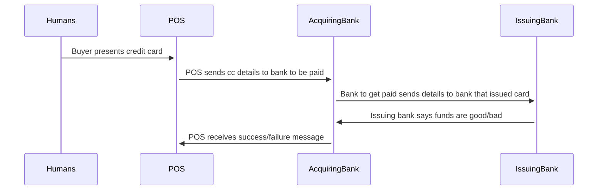

# MAGIC

*MAGIC* is a backronym for Multi-device Asynchronous Generic Input/output Consensus.

Yes, seriously. 

It is, in essence, a generalization of the process by which bank settlement happens with debit and credit card purchases. 
Though purchasing is one of its use cases, MAGIC can allow for a whole host of interesting interactions between that have never interacted before, and need not interact again.
It is always a little contrived to call technology magic, but as David Copperfield said at a show of his I went to as a kid, "we all know that magic isn't real, but if it was, here's what it would look like."

<MAGIC video>

## Overview

Most transactions in cyberspace happen between a client and a server.
Usually the client is either a computer or a phone, and the server is software running on some amorphous collection of hardware living in some data center somewhere.
It's not uncommon for the server to receive a request, and hand off some or all of it to a trusted third party through the use of an API token, or user-based authentication like OAuth2.0. 
MAGIC uses [Sessionless][sessionless] to enable trust in the third party from the _client_ instead of the server.

Wihtout needing the client to establish a connection with the server to use the third party, the server can actually skip authenticating the client, and simply passthrough requests to the third party.
As stated above, this is how payment processing at store with a POS works. 
The buyer presents a request via their credit card, the POS machine, which knows nothing of the buyer, forwards that request to a trusted third party, the credit card company, who in turn notifies the banks, and if everything is good, the transaction settles, the POS machine receives a successful response, and the shopowner completes the transaction.

Here's a picture of that process:

So in this transaction the humans do something, the POS reads a card and gets a token, that token is sent to a bank, and decoded then sent to another bank, which approves the transaction. 
The approval then gets sent back the other way, and all the pieces agree on whether it succeeded or failed. 
The card networks (Visa, MasterCard, Discover, Amex) provide the routing between banks. 
Merchants get charged a flat percentage or fee on the transaction, something like 2.5-3.5%, and the card networks and banks all take a slice and everyone is happy.

This whole system was pretty advanced in the early 70s when it was first computerized. 
But it's fifty years later, and magnetic strips aren't pushing the envelope anymore.

## The internet

Twenty years after credit cards were computerized, a new problem faced the banks.
A fledgling network of computers was growing, and people were wanting to spend money on each other's goods.
A company called First Virtual Holdings, Inc. were the first to recognize that a solution for credit card payments was necessary for the web.
A few years later, Peter Thiel and Max Levchin started Confinity, which merged with Elon Musk's X.com, then renamed itself to PayPal, and was acquired then by eBay, a series of events which has pretty consistently made the argument that maybe people shouldn't be billionaires ever since.

Why do we need PayPal? 
Because our browsers, and thus the web is inherently insecure, and credit cards are pretty hilariously insecure.
So the original solution was some UX nightmare of email confirmations. 
Nowadays we have slick UIs that are dropped into websites and apps where people can enter credit card numbers with minimal threat of them getting stolen. 

When you do this, your card gets tokenized, and stored for future use if you want. 
And here's where MAGIC comes in.
Because there's no reason why that token needs to be trapped in a single company's database.
All you need is a way of associating your account in one app, with the account in the app where the token is stored.
Then you can use that token for purchases, and don't have to keep re-entering your card.

Let's take a look at that picture:

[sessionless]: https://www.github.com/planet-nine-app/sessionless
