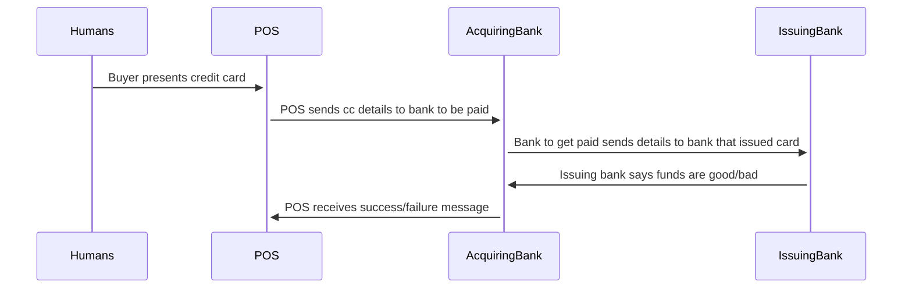
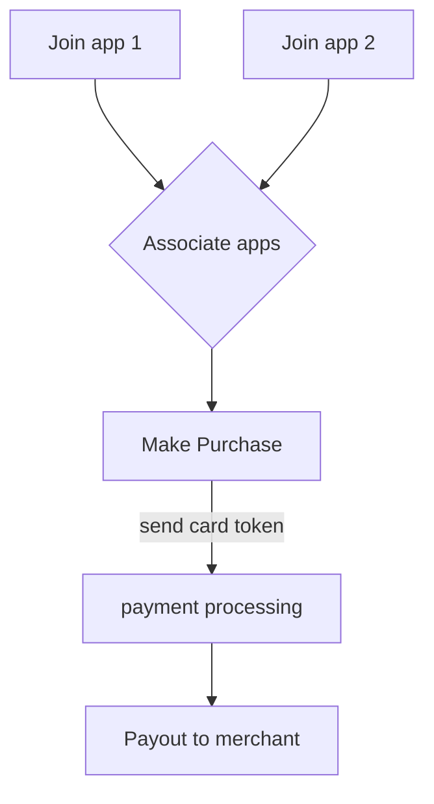
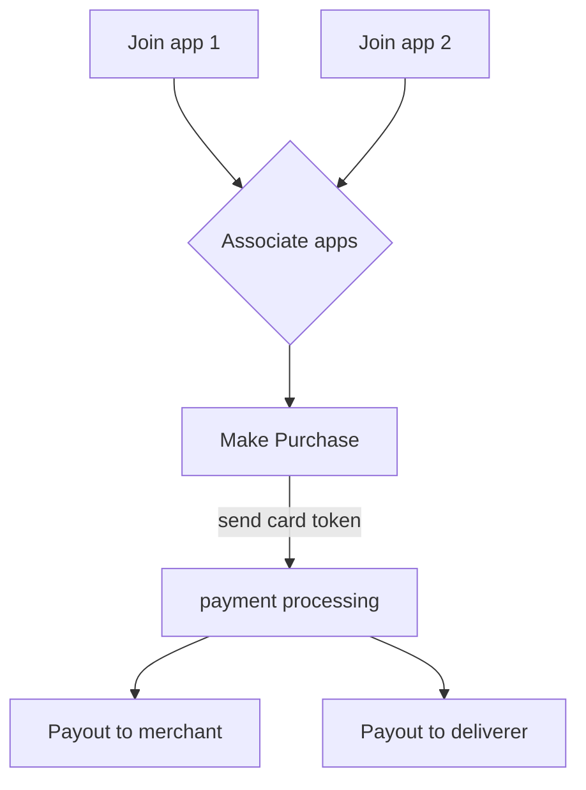

# MAGIC

*MAGIC* is a backronym for Multi-device Asynchronous Generic Input/output Consensus.

Yes, seriously. 

It is, in essence, a generalization of the process by which bank settlement happens with debit and credit card purchases. 
Though purchasing is one of its use cases, MAGIC can allow for a whole host of interesting interactions between devices that have never interacted before, and need not interact again.
It is always a little contrived to call technology magic, but as David Copperfield said at a show of his I went to as a kid, "we all know that magic isn't real, but if it was, here's what it might look like."

[Here is a simple video of what MAGIC can do.]

## Overview

Most transactions in cyberspace happen between a client and a server.
Usually the client is either a computer or a phone, and the server is software running on some amorphous collection of hardware living in some data center somewhere.
It's not uncommon for the server to receive a request, and hand off some or all of it to a trusted third party through the use of an API token, or user-based authentication like OAuth2.0. 
MAGIC uses [Sessionless][sessionless] to enable trust in the third party from the _client_ instead of the server.

Wihtout needing the client to establish a connection with the server to use the third party, the server can actually skip authenticating the client, and simply passthrough requests to the third party.
As stated above, this is how payment processing at stores with a POS works. 
The buyer presents a request via their credit card, the POS machine, which knows nothing of the buyer, forwards that request to a trusted third party, the credit card company, who in turn notifies the banks, and if everything is good, the transaction settles, the POS machine receives a successful response, and the shopowner completes the transaction.

Here's a picture of that process:

So in this transaction the humans do something, the POS reads a card and gets a token, that token is sent to a bank, and decoded, then sent to another bank, which approves the transaction. 
The approval then gets sent back the other way, and all the pieces agree on whether it succeeded or failed. 
The card networks (Visa, MasterCard, Discover, Amex) provide the routing between banks. 
Merchants get charged a flat percentage or fee on the transaction, something like 2.5-3.5%, and the card networks and banks all take a slice and everyone is happy.

This whole system was pretty advanced in the early 70s when it was first computerized. 
But it's fifty years later, and magnetic strips aren't pushing the envelope anymore.

## The internet

Twenty years after credit cards were computerized, a new problem faced the banks.
A fledgling network of computers was growing, and people were wanting to spend money on each other's goods.
A company called First Virtual Holdings, Inc. were the first to recognize that a solution for credit card payments was necessary for the web.
A few years later, Peter Thiel and Max Levchin started Confinity, which merged with Elon Musk's X.com, then renamed itself to PayPal, and was acquired then by eBay, a series of events which has pretty consistently made the argument that maybe people shouldn't be billionaires ever since.

Why do we need PayPal? 
Because our browsers, and thus the web is inherently insecure, and credit cards are pretty hilariously insecure.
So the original solution was some UX nightmare of email confirmations. 
Nowadays we have slick UIs that are dropped into websites and apps where people can enter credit card numbers with minimal threat of them getting stolen. 

When you do this, your card gets tokenized, and stored for future use if you want. 
And here's where MAGIC comes in.
Because there's no reason why that token needs to be trapped in a single company's database.
All you need is a way of associating your account in one app, with the account in the app where the token is stored.
Then you can use that token for purchases, and don't have to keep re-entering your card.

Let's take a look at that picture:

So long as the merchant can be linked via the processor, everyone gets their cut, and everyone's happy.

So great, we can make purchases from one app in another app. 
That's kind of interesting, but nothing earth shattering. 
But what about this picture:

This picture's a little more interesting. 
Now you have the user's payment split some way between the merchant and a delivery service (say something needs to be shipped, or food is getting delivered).
So long as the user, merchant, and delivery service are all tokenized by the same processor, this works.

Of course tokenizing with the same processor has historically meant they're all part of the same company.
But remember with Sessionless, we can associate accounts. 
So so long as implementers can resolve the keys involved in the transaction back to accounts tokenized with the same processor, everyone gets paid.

And that's what MAGIC does.
It allows implementers to construct payment pipelines that initiate from a user action, which can be as simple as tapping a button, to as interesting as waving a wand and saying a magic word, and process an arbitrary set of inputs to be resolved in such a way that all participants agree. 
Just like payments have always done, just with the ability to add actors without a bunch of account management.

## What about non-payments?

When I first thought of MAGIC (you can read the [original patent here][magic-patent]). 
We were struggling to find a solution to the micropayments used in the mobility space (if a bus ticket is $2.50, and your payment processor takes $0.30 + 3%, you're losing 15% off your transaction).
I was charged with building a stored value system to make it so we'd only have to pay the transaction fee on larger amounts, since the "top-offs" were typically larger than $2.50.  

The problem with stored value systems, is that, as anyone who has cleaned out their wallet only to find the expired gift card they got three years ago knows, they're only valuable so long as you keep using whatever it is that the stored value is linked to.
That's a pretty decent system for something like transit where people tend to use it consistently, but does it work for point-to-point rental cars (car2go was still around back then)?
Does it work for scooters?

So I started thinking about how could a stored value system work for multiple verticals so that you could make something like a mobility card that worked across different companies.
That thinking is what led me to think about digital identity, and write this paper: [Digital Identity for Smart Cities][smart-cities].
And that in turn started me down the path to what eveentually would be called [Sessionless][sessionless].

When I combined the digital identity piece with the stored value piece in a development environment that didn't use real money, I realized I had built something familiar--it was basically just how my magic system worked in [The Epic of Roderick][teor], a game I tried to develop many years ago.
Except instead of hurling fireballs at monsters, this magic system could do, well, anything computers can do.

And that is interesting.

## So what is MAGIC again?

So MAGIC (Multi-device Asynchronous Generic Input/output Consensus) is a protocol for getting multiple computing devices to agree that a transaction has taken place.
That transaction can involve money, or involve MP.
The protocol is open sourced, and available under a broad license so that anyone can use it so long as they agree that their MAGIC transactions be interoperable with other systems' MAGIC transactions.
That way additions to the protocol benefit all the users of the protocol. 

Below are links to the developer and UX READMEs for MAGIC:

| Dev          | UX          | Product     |
|--------------|-------------|-------------|
| [README-DEV] | [README-UX] | coming soon |

[sessionless]: https://www.github.com/planet-nine-app/sessionless
[magic-patent]: https://www.planetnineapp.com/magic
[blog]: https://www.planetnineapp.com/blog
[README-DEV]: ./README-DEV.md
[README-UX]: ./README-UX.md
[Here is a simple video of what MAGIC can do.]: https://www.planetnineapp.com/magic-demo-1
[smart-cities]: https://static1.squarespace.com/static/5bede41d365f02ab5120b40f/t/65d305f9682e3158ed9386cf/1708328441775/ACM+Identity+Paper.pdf
[teor]: https://github.com/zach-planet-nine/Epic-of-Roderick?tab=readme-ov-file#the-epic-of-roderick
