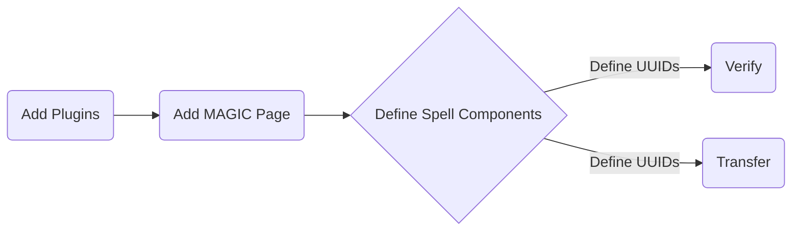

# Federated Wiki - MAGIC plugin

This plugin adds MAGICal capabilities to the [federated wiki][wiki]. 

## Usage

Adding this component to a page allows the wiki owner to expose authenticated routes via MAGIC.
This means you can utilize things like `/plugin/ftt/transfer` for transferring tokens, or `/plugin/ftt/verify` for verifying signatures.
You can set the uuids that you'll accept for the spell chain.

This creates a flow that looks like:

So for something like a smart contract that transfers a token from one user to another upon some MAGICal input, you would: 

1) Add the MAGIC plugin
2) Create a MAGIC page with the plugin that adds the transfer route from the [ftt plugin][ftt]
3) Create a "smart contract" using the signature plugin, which will add the UUIDs of the signers to the allowed UUIDs for the route
4) Do your MAGIC somewhere

## License

MIT

[wiki]: https://github.com/fedwiki
[ftt]: https://github.com/planet-nine-app/wiki-plugin-ftt

